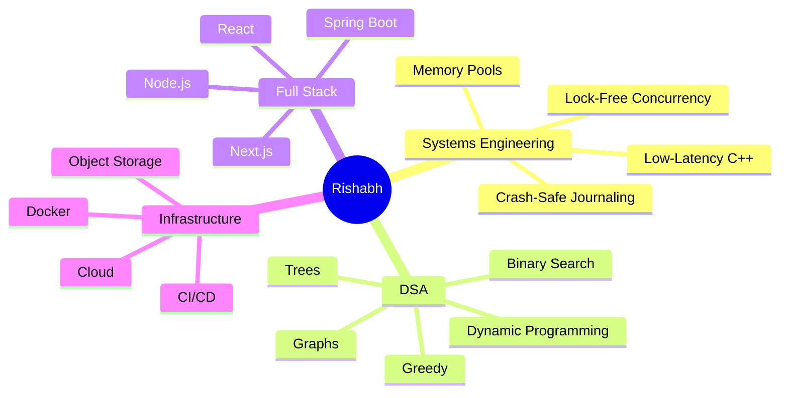

<div align="center">


<a href="https://github.com/rishabhdev0">
  
</a>
<a href="https://github.com/rishabhdev0?tab=followers">
  
</a>
<a href="https://codeforces.com/profile/rishabh_code">
  
</a>
<a href="https://leetcode.com/u/rishabh_code/">
  
</a>
<a href="https://www.hackerrank.com/profile/rishabh52003">
  
</a>

<br><br>


</div>

---

## 🧠 About Me

```text
┌──────────────────────────────────────────────────────────────┐
│                                                                │
│  🎓 Final-year AIML student (AKTU)                            │
│  💼 Data Analyst Intern @ Bluestock Fintech                   │
│  💻 Full-Stack Developer — Next.js / TypeScript / tRPC        │
│  ⚙️  Systems Programmer — C++ low-latency engineering          │
│  🧩 Competitive Programmer — LeetCode Knight, 1800+ rating     │
│  🚀 Building production-style, benchmarked software            │
│                                                                │
└──────────────────────────────────────────────────────────────┘
```

I like taking an idea from **zero → architecture → implementation → benchmark → deployment**.
Most of my learning happens by building things, breaking them, measuring exactly how broken they were, and rebuilding them faster.

> **Current mission:** be the engineer who can both solve the algorithm *and* engineer the system it has to run inside of, under real load, with numbers to prove it.

---

## ⚡ What I'm Doing Right Now

<table>
<tr>
<td width="50%" valign="top">

### 🏗️ Building

**`liquidity-engine`** — a low-latency stock exchange matching engine in C++

* Lock-free SPSC ring buffer for ingest
* Custom memory pool allocator (~21x faster than `new`/`delete`)
* Crash-safe append-only journal with replay-on-restart
* IOC / FOK / modify-in-place order semantics
* Live WebSocket dashboard in Next.js

</td>
<td width="50%" valign="top">

### 🧩 Improving

**Problem Solving — daily habit**

* Arrays & Strings · Binary Search
* Graphs · Dynamic Programming
* Greedy · Trees · Advanced patterns

**Platforms:** Codeforces · LeetCode · HackerRank

</td>
</tr>
</table>

---

## 🚀 Proof of Work

> I prefer showing what I built (and how fast it runs) over just listing what I know.

### ⚙️ `liquidity-engine` — Low-Latency Matching Engine — 🏆 Flagship Project

**A from-scratch stock exchange matching engine in C++, built in phases and benchmarked at every stage — not a toy order book.**

`C++` `CMake` `GoogleTest` `Google Benchmark` `WebSocket` `Next.js` `Lock-Free Concurrency`

```text
     Ingest Thread                Matching Thread
   ┌────────────────┐          ┌────────────────────┐
   │  Order Gateway  │  SPSC   │  MatchingEngine     │
   │  (WebSocket)    │ ──────► │  ┌───────────────┐  │
   └────────────────┘ Ring Buf │  │ OrderBook      │  │
                                │  │ (price-time    │  │
                                │  │  priority)     │  │
                                │  └───────┬───────┘  │
                                │          │           │
                                │   MemoryPool<Order>  │
                                │   (3.67ns/op alloc)  │
                                └──────────┬───────────┘
                                           │
                              ┌────────────▼────────────┐
                              │  Append-Only Journal     │
                              │  (crash-safe, replayed   │
                              │   on restart)            │
                              └────────────┬────────────┘
                                           │
                              ┌────────────▼────────────┐
                              │  Live Dashboard (Next.js)│
                              │  Price/Depth charts,     │
                              │  order entry, trade tape │
                              └──────────────────────────┘
```

**Real, measured numbers — not marketing copy:**

| Metric | Result |
|---|---|
| Order allocation (raw `new`/`delete`) | ~79.2 ns/op |
| Order allocation (custom memory pool) | **~3.67 ns/op (~21x faster)** |
| 10k-order batch churn, pooled vs. raw | **~28.9x faster** |
| Single-threaded rest + fill | ~564 ns / ~1.7–2.1M ops/sec |
| Concurrent (SPSC-decoupled) producer path | ~1674 ns/op — a deliberate decoupling cost, not a raw-speed win: the ingest thread never blocks on matching |
| Test suite | 57 passing GoogleTest cases across order book, engine, concurrency, journal replay, and order-type semantics |

**Engineering it actually took to get here:**
- Built the order book with **price-time priority**, O(1) cancel via index map, and full IOC / FOK / modify-in-place semantics that mirror real exchange behavior (a price or size-increase change loses time priority; a size decrease keeps it)
- Wrote a custom **memory pool** to kill `malloc` pauses on the hot path, then benchmarked it against the naive version to prove the win
- Built a **lock-free SPSC ring buffer** to decouple network ingest from matching, and found + fixed a real stack-overflow bug caused by storing the buffer inline instead of on the heap
- Added a **crash-safe append-only journal** that replays on restart to rebuild pre-crash state
- Shipped a live **Next.js dashboard** over a WebSocket bridge — price chart, depth chart, order entry, live order cancel, and round-trip latency display

🔗 **Repository:** [rishabhdev0/liquidity-engine](https://github.com/rishabhdev0/liquidity-engine)

---

### 🗳️ CipherVote — Blockchain Voting System

A security-focused voting platform exploring how to make digital voting **verifiable without exposing individual ballots**.

`Blockchain` `Cryptography` `Zero-Knowledge Proofs` `React` `Smart Contracts`

* Smart-contract-backed ballot casting and tallying
* Zero-knowledge proof design for ballot privacy vs. verifiability
* React frontend for wallet-based voting

🔗 **Repository:** [rishabhdev0/CipherVote](https://github.com/rishabhdev0/CipherVote)

---

### 📊 Nexora — Business Intelligence & Sales Analytics

**A full-stack analytics platform designed around real-world business workflows.**

`Next.js` `TypeScript` `PostgreSQL` `Redis` `Docker` `S3` `Authentication` `Data Visualization`

```text
Data Sources → API Layer → Redis Cache → PostgreSQL
                                 │
                                 ▼
                    Analytics Engine (KPIs · Trends · Reports)
                                 │
                                 ▼
                 Interactive Dashboard (Charts · Filters · KPIs)
```

🔗 **Repository:** [View Project](https://github.com/rishabhdev0)

---

### 🎙️ Sonicra — AI Voice Generation Platform

A voice-generation SaaS focused on a clean, production-style user experience.

`Next.js` `React` `TypeScript` `Chatterbox TTS` `Prisma` `Clerk` `Cloud Storage`

* AI voice generation & voice cloning
* Async generation workflows, SaaS billing architecture

🔗 **Repository:** [View Project](https://github.com/rishabhdev0)

---

## 📈 Engineering Activity

<div align="center">

</div>

<br>

<div align="center">


</div>

<br>

<div align="center">

</div>

---

## 🧮 Competitive Programming

<div align="center">


<br><br>


</div>

| Platform | Profile | Focus |
|---|---|---|
| 🔵 **Codeforces** | [rishabh_code](https://codeforces.com/profile/rishabh_code) | Competitive Programming · Rated Contests |
| 🟠 **LeetCode** | [rishabh_code](https://leetcode.com/u/rishabh_code/) | DSA · Interview Problems · Patterns (Knight, 1800+) |
| 🟢 **HackerRank** | [rishabh52003](https://www.hackerrank.com/profile/rishabh52003) | Algorithms · SQL · Problem Solving |

### 🧠 Patterns I'm Grinding

```text
Arrays          ████████████████████
Binary Search   █████████████████
Graphs          ███████████████
DP              █████████████
Greedy          ████████████
Trees           ███████████
Advanced DSA    █████████
```

---

## 🛠️ Tech Stack

### Languages
<p></p>

### Frontend
<p></p>

### Backend
<p></p>

### Databases & Infrastructure
<p></p>

### Tools
<p></p>

---

## 🏆 GitHub Achievements

<div align="center">

</div>

---

## 🌱 Currently Learning



---

## 🔥 My Developer Loop

```text
   IDEA 💡 → DESIGN 🎨 → BUILD 🛠️ → BREAK 💥 → DEBUG 🐛 → BENCHMARK 📊 → SHIP 🚀 → REPEAT
```

---

## 📌 Featured Projects

<div align="center">
<a href="https://github.com/rishabhdev0/liquidity-engine">

</a>
<a href="https://github.com/rishabhdev0/CipherVote">

</a>
</div>

---

## 🤝 Let's Connect

<div align="center">

<a href="https://linkedin.com/in/rishabh-pandey-254a08285/">

</a>
<a href="mailto:rishabh52003@gmail.com">

</a>
<a href="https://x.com/Rishabh58750540">

</a>
<a href="https://github.com/rishabhdev0">

</a>

</div>

---

<div align="center">

### `Build → Break → Benchmark → Ship → Repeat`


</div>
