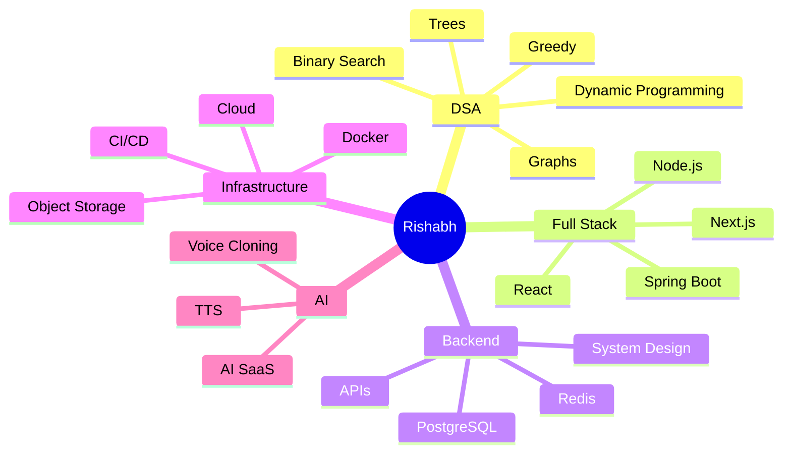

<div align="center">

# 👋 Hey, I'm Rishabh Pandey

### `Software Engineer in the Making` · `Problem Solver` · `Full-Stack Developer`

<a href="https://github.com/rishabhdev0">
  
</a>
<a href="https://github.com/rishabhdev0?tab=followers">
  
</a>

<br><br>


</div>

---

## 🧠 About Me

```text
┌──────────────────────────────────────────────────────────────┐
│                                                              │
│  🎓 Computer Science Student                                 │
│  💻 Full-Stack Developer                                     │
│  🧩 Competitive Programmer                                   │
│  🚀 Building production-style software                       │
│  🧠 Obsessed with problem solving & system design             │
│                                                              │
│  Currently exploring                                         │
│  ├── React / Next.js                                         │
│  ├── Node.js / Express                                       │
│  ├── Spring Boot                                             │
│  ├── PostgreSQL / Redis                                     │
│  ├── Docker / Cloud Deployment                               │
│  └── Advanced DSA & Competitive Programming                  │
│                                                              │
└──────────────────────────────────────────────────────────────┘
```

I like taking an idea from **zero → architecture → implementation → deployment**.

Most of my learning happens by building things, breaking them, debugging them, and rebuilding them better.

> **Current mission:** become the kind of engineer who can solve algorithmic problems *and* build systems people can actually use.

---

# ⚡ What I'm Doing Right Now

<table>
<tr>
<td width="50%">

### 🏗️ Building

**Nexora — Business Intelligence Platform**

A production-style analytics platform focused on:

* 📊 Sales & business analytics
* 📈 Interactive dashboards
* 🔐 Authentication & authorization
* 🗄️ PostgreSQL
* ⚡ Redis caching
* 📦 Object storage
* 🐳 Dockerized infrastructure
* ☁️ Cloud deployment

</td>

<td width="50%">

### 🧩 Improving

**Problem Solving**

Currently working through:

* Arrays & Strings
* Binary Search
* Graphs
* Dynamic Programming
* Greedy
* Trees
* Advanced problem-solving patterns

Platforms:

**LeetCode · Codeforces · HackerRank**

</td>
</tr>
</table>

---

# 🚀 Proof of Work

> I prefer showing what I build over simply listing what I know.

### 📊 Nexora — Business Intelligence & Sales Analytics

**A full-stack analytics platform designed around real-world business workflows.**

`Next.js` `TypeScript` `PostgreSQL` `Redis` `Docker` `S3` `Authentication` `Data Visualization`

**What I'm building:**

```text
Data Sources
     │
     ▼
┌─────────────┐
│   Backend   │
│ API Layer   │
└──────┬──────┘
       │
       ├──────────────► Redis Cache
       │
       ▼
┌─────────────┐
│ PostgreSQL  │
│ Data Store  │
└──────┬──────┘
       │
       ▼
┌─────────────────────────┐
│ Analytics Engine        │
│ KPIs · Trends · Reports │
└────────────┬────────────┘
             │
             ▼
┌─────────────────────────┐
│ Interactive Dashboard   │
│ Charts · Filters · KPIs │
└─────────────────────────┘
```

🔗 **Repository:** [View Project](https://github.com/rishabhdev0)

---

### 🎙️ Sonicra — AI Voice Generation Platform

A voice-generation SaaS focused on a clean, production-style user experience.

`Next.js` `React` `TypeScript` `Chatterbox TTS` `Prisma` `Clerk` `Cloud Storage`

**Core ideas:**

* 🎙️ AI voice generation
* 🗣️ Voice cloning
* ⚡ Async generation workflows
* 🔐 Authentication
* 💳 SaaS billing architecture
* ☁️ Cloud infrastructure
* 📁 Audio storage

**Goal:** make AI voice generation feel like a polished developer product rather than an AI experiment.

🔗 **Repository:** [View Project](https://github.com/rishabhdev0)

---

### 🗳️ Cipher Vote — Blockchain Voting System

A security-focused voting platform exploring:

`Blockchain` `Cryptography` `Zero-Knowledge Proofs` `React` `Smart Contracts`

Designed around the question:

> **How can we make digital voting verifiable without exposing individual ballots?**

---

## 📈 My Engineering Activity

<div align="center">


</div>

<br>

<div align="center">


</div>

<br>

<div align="center">


</div>

---

# 🧮 Competitive Programming

<div align="center">

### Problem Solving is a daily habit.


</div>

<br>

| Platform          | Focus                                     |
| ----------------- | ----------------------------------------- |
| 🟠 **LeetCode**   | DSA · Interview Problems · Patterns       |
| 🔵 **Codeforces** | Competitive Programming · Problem Solving |
| 🟢 **HackerRank** | Algorithms · SQL · Problem Solving        |

### 🧠 Patterns I'm Grinding

```text
Arrays          ████████████████████
Binary Search   █████████████████
Graphs          ███████████████
DP              █████████████
Greedy          ████████████
Trees           ███████████
Advanced DSA    █████████
```

---

# 🛠️ Tech Stack

### Languages

<p>

</p>

### Frontend

<p>

</p>

### Backend

<p>

</p>

### Databases & Infrastructure

<p>

</p>

### Tools

<p>

</p>

---

# 🏆 GitHub Achievements

<div align="center">


</div>

---

# 📊 Contribution Heatmap

<div align="center">


</div>

---

# 🌱 Currently Learning



---

# 🔥 My Developer Loop

```text
             ┌──────────────┐
             │    IDEA 💡   │
             └──────┬───────┘
                    ↓
             ┌──────────────┐
             │   DESIGN 🎨  │
             └──────┬───────┘
                    ↓
             ┌──────────────┐
             │    BUILD 🛠️  │
             └──────┬───────┘
                    ↓
             ┌──────────────┐
             │  BREAK 💥    │
             └──────┬───────┘
                    ↓
             ┌──────────────┐
             │ DEBUG 🐛     │
             └──────┬───────┘
                    ↓
             ┌──────────────┐
             │ OPTIMIZE ⚡  │
             └──────┬───────┘
                    ↓
             ┌──────────────┐
             │  SHIP 🚀     │
             └──────┬───────┘
                    │
                    └──────────────► REPEAT
```

---

# 📌 Featured Projects

<div align="center">

<a href="https://github.com/rishabhdev0">

</a>

<a href="https://github.com/rishabhdev0">

</a>

</div>

---

# 🤝 Let's Connect

<div align="center">

<a href="https://linkedin.com/in/rishabh-pandey-254a08285/">

</a>

<a href="mailto:rishabh52003@gmail.com">

</a>

<a href="https://x.com/Rishabh58750540">

</a>

<a href="https://github.com/rishabhdev0">

</a>

</div>

---

<div align="center">

### `Build → Break → Learn → Ship → Repeat`

<br>


</div>
