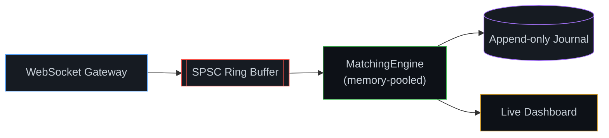
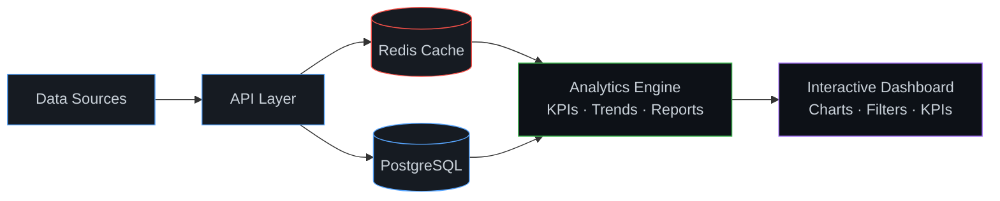
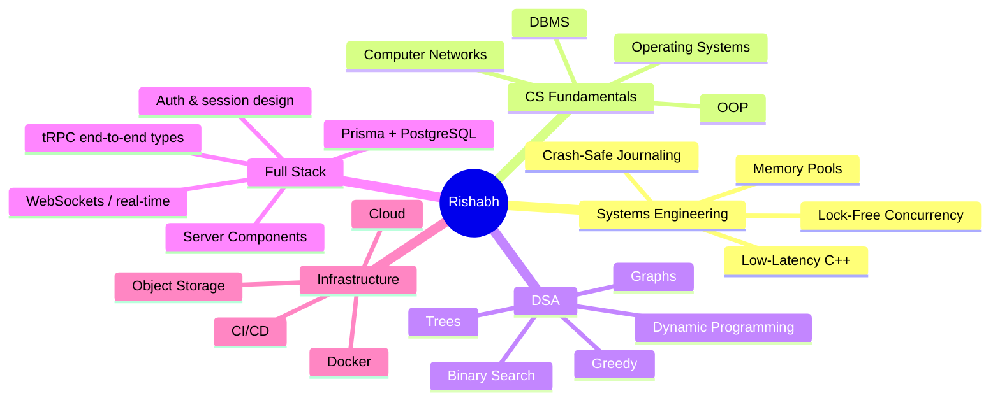

<div align="center">


<a href="https://github.com/rishabhdev0">
  
</a>
<a href="https://github.com/rishabhdev0?tab=followers">
  
</a>
<a href="https://codeforces.com/profile/rishabh_code">
  
</a>
<a href="https://leetcode.com/u/rishabh_code/">
  
</a>
<a href="https://www.hackerrank.com/profile/rishabh52003">
  
</a>

<br><br>


</div>

---

## 🧠 About Me

```text
┌──────────────────────────────────────────────────────────────┐
│                                                                │
│  🎓 Final-year AIML student (AKTU)                            │
│  💼 Data Analyst Intern @ Bluestock Fintech                   │
│  💻 Full-Stack Developer — Next.js / TypeScript / tRPC        │
│  ⚙️  Systems Programmer — C++ low-latency engineering          │
│  🧩 Competitive Programmer — LeetCode Knight, 1800+ rating     │
│  🚀 Building production-style, benchmarked software            │
│                                                                │
└──────────────────────────────────────────────────────────────┘
```

I like taking an idea from **zero → architecture → implementation → benchmark → deployment**.
Most of my learning happens by building things, breaking them, measuring exactly how broken they were, and rebuilding them faster.

> **Current mission:** be the engineer who can both solve the algorithm *and* engineer the system it has to run inside of, under real load, with numbers to prove it.

---

## ⚡ What I'm Doing Right Now

<table>
<tr>
<td width="50%" valign="top">

### 🏗️ Building

**Nexora** — a full-stack BI & sales analytics platform

* Analytics engine — KPIs, trends, reports
* Interactive dashboards — charts & filters
* Auth, PostgreSQL, Redis caching
* Object storage (S3), Dockerized infra

</td>
<td width="50%" valign="top">

### 🧩 Improving

**Problem Solving — daily habit**

* Arrays & Strings · Binary Search
* Graphs · Dynamic Programming
* Greedy · Trees · Advanced patterns

**Platforms:** Codeforces · LeetCode · HackerRank

</td>
</tr>
</table>

---

## 🚀 Proof of Work

> I prefer showing what I built (and how fast it runs) over just listing what I know.

### ⚙️ `liquidity-engine` — Low-Latency Matching Engine — 🏆 Flagship Project

**A stock exchange matching engine in C++ — lock-free, memory-pooled, crash-safe.**

<p>


</p>



| Metric | Result |
|---|---|
| Memory pool vs. raw `new`/`delete` | **~21x faster** (3.67ns vs 79.2ns/op) |
| Throughput | ~1.7–2.1M ops/sec single-threaded |
| Test coverage | 57 passing GoogleTest cases |

- Price-time priority order book with O(1) cancel, IOC/FOK, and live modify
- Lock-free SPSC ring buffer decouples ingest from matching (found & fixed a real stack-overflow bug here)
- Crash-safe journal replays on restart · live Next.js dashboard over WebSocket

🔗 **Repository:** [rishabhdev0/liquidity-engine](https://github.com/rishabhdev0/liquidity-engine)

---

### 🗳️ CipherVote — Blockchain Voting System

A security-focused voting platform exploring how to make digital voting **verifiable without exposing individual ballots**.

<p>


</p>

* Smart-contract-backed ballot casting and tallying
* Zero-knowledge proof design for ballot privacy vs. verifiability
* React frontend for wallet-based voting

🔗 **Repository:** [rishabhdev0/CipherVote](https://github.com/rishabhdev0/CipherVote)

---

### 📊 Nexora — Business Intelligence & Sales Analytics

**A full-stack analytics platform designed around real-world business workflows.**

<p>


</p>



🔗 **Repository:** [View Project](https://github.com/rishabhdev0)

---

### 🎙️ Sonicra — AI Voice Generation Platform

A voice-generation SaaS focused on a clean, production-style user experience.

<p>


</p>

* AI voice generation & voice cloning
* Async generation workflows, SaaS billing architecture

🔗 **Repository:** [rishabhdev0/Sonicra](https://github.com/rishabhdev0/Sonicra)

---

## 📈 Engineering Activity

<div align="center">

</div>

<br>

<div align="center">

</div>

---

## 🧮 Competitive Programming

<div align="center">


<br><br>


</div>

| Platform | Profile | Focus |
|---|---|---|
| 🔵 **Codeforces** | [rishabh_code](https://codeforces.com/profile/rishabh_code) | Competitive Programming · Rated Contests |
| 🟠 **LeetCode** | [rishabh_code](https://leetcode.com/u/rishabh_code/) | DSA · Interview Problems · Patterns (Knight, 1800+) |
| 🟢 **HackerRank** | [rishabh52003](https://www.hackerrank.com/profile/rishabh52003) | Algorithms · SQL · Problem Solving |

### 🧠 Patterns I'm Grinding

```text
Arrays          ████████████████████
Binary Search   █████████████████
Graphs          ███████████████
DP              █████████████
Greedy          ████████████
Trees           ███████████
Advanced DSA    █████████
```

---

## 🛠️ Tech Stack

### Languages
<p></p>

### Frontend
<p></p>

### Backend
<p></p>

### Databases & Infrastructure
<p></p>

### Tools
<p></p>

---

## 🏆 GitHub Achievements

<div align="center">


**Pull Shark** · **YOLO**

</div>

---

## 🌱 Currently Learning



---

## 🔥 My Developer Loop

```text
   IDEA 💡 → DESIGN 🎨 → BUILD 🛠️ → BREAK 💥 → DEBUG 🐛 → BENCHMARK 📊 → SHIP 🚀 → REPEAT
```

---

## 📌 Featured Projects

| Repo | Description |
|---|---|
| ⚙️ **[liquidity-engine](https://github.com/rishabhdev0/liquidity-engine)** | Low-latency C++ matching engine — lock-free, memory-pooled, crash-safe |
| 🗳️ **[CipherVote](https://github.com/rishabhdev0/CipherVote)** | Blockchain voting system with zero-knowledge ballot privacy |
| 🎙️ **[Sonicra](https://github.com/rishabhdev0/Sonicra)** | AI voice generation SaaS with cloning & async workflows |

---

## 🤝 Let's Connect

<div align="center">

<a href="https://linkedin.com/in/rishabh-pandey-254a08285/">

</a>
<a href="mailto:rishabh52003@gmail.com">

</a>
<a href="https://x.com/Rishabh58750540">

</a>
<a href="https://github.com/rishabhdev0">

</a>

</div>

---

<div align="center">

### `Build → Break → Benchmark → Ship → Repeat`


</div>
